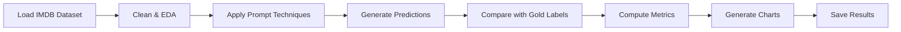
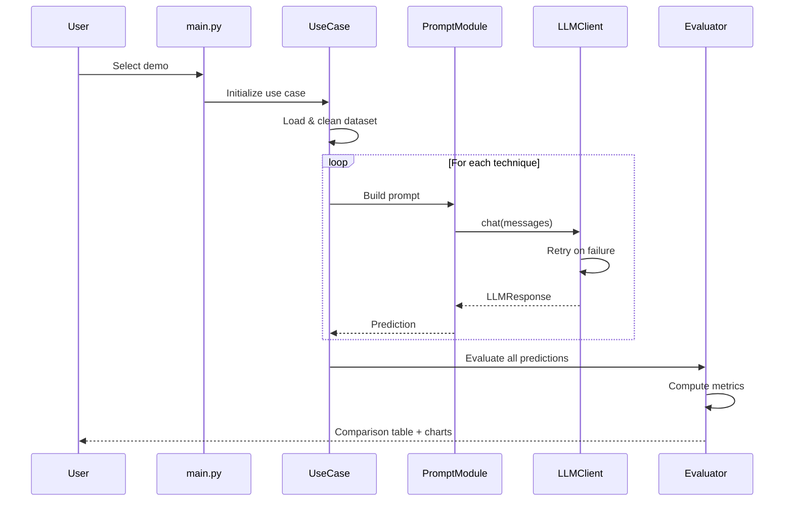
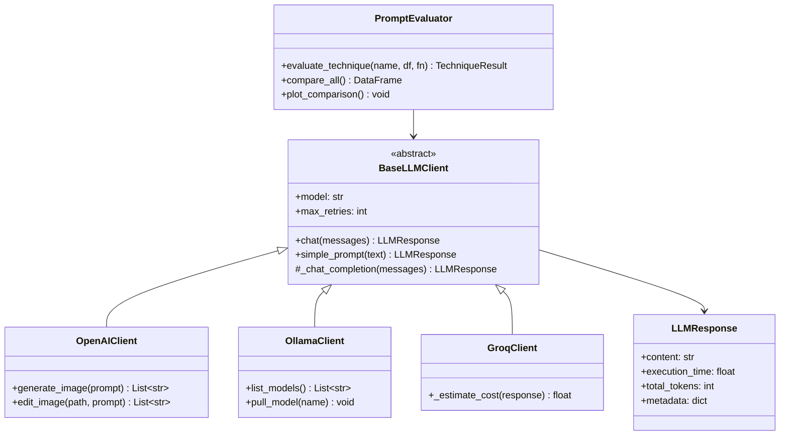

# Workflow Documentation

## End-to-End Workflow

### 1. Setup Phase

```
Install dependencies → Configure .env → Verify API keys → Run tests
```

### 2. Prompt Engineering Demo

```
Select technique → Build prompt → Send to LLM → Display response + metrics
```

### 3. Sentiment Analysis Workflow



**Steps:**
1. Load IMDB reviews (or built-in sample)
2. Clean text data, compute statistics
3. Generate EDA visualizations
4. Run 6 prompting techniques on each sample
5. Compute Accuracy, Precision, Recall, F1
6. Generate confusion matrices per technique
7. Create comparison bar charts (accuracy, speed, cost)
8. Export results to CSV

### 4. Spam Detection Workflow

Same pipeline as sentiment analysis but with SMS Spam dataset and ham/spam labels.

### 5. Image Generation Workflow

```
Craft prompt → OpenAI DALL-E API → Download image → Save to images/generated/
```

### 6. Image Transformation Workflow

```
Source PNG → Optional mask → Edit prompt → DALL-E Edit API → Save to images/transformed/
```

## Evaluation Pipeline

| Step | Input | Output |
|------|-------|--------|
| Load Data | CSV/Archive | pandas DataFrame |
| Predict | Text + Technique | Label prediction |
| Score | Predictions + Gold labels | Accuracy, F1, etc. |
| Compare | All technique results | Comparison DataFrame |
| Visualize | Metrics | PNG charts in outputs/ |

## Sequence Diagram



## Class Diagram


